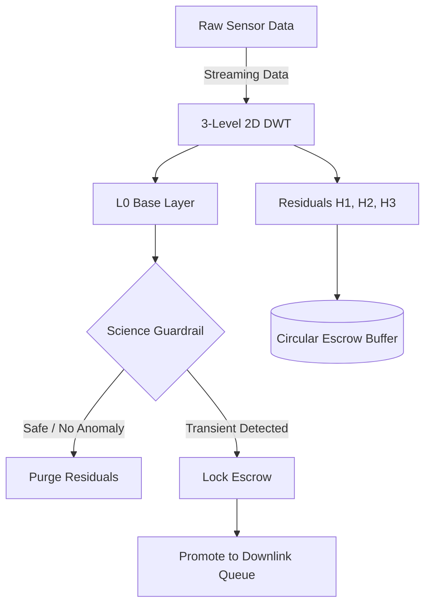
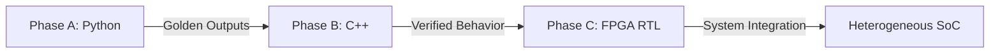

# EventVault-R

> **Progressive, Uncertainty-Bounded Science-Data Escrow Architecture for Resource-Constrained CubeSat Astronomy**
>
> *Om Awthankar, Dax Shah — VIT Vellore*

[](#)
[](#)

EventVault-R is the core data-management algorithm of the **AstraVault** architecture. It is designed to tackle the downlink bandwidth bottleneck in next-generation astronomical surveys by acting as an autonomous "dashcam" for telescopes. It treats high-resolution scientific data as a temporary **escrow asset** rather than an immediately disposable resource.

---

## 🌌 Conceptual Overview

Traditional observation models capture and transmit all sensor data, relying on ground-based processing to identify transient events (e.g., supernovae, fast radio bursts). **EventVault-R shifts this paradigm to the edge.**

Each astronomical image is decomposed into progressively refinable wavelet layers using a **2D Biorthogonal 4.4 Discrete Wavelet Transform (DWT)**:
- **Base Layer (L0)**: A compact layer retained permanently for situational awareness.
- **Residual Layers (H1, H2, H3)**: High-frequency details held temporarily in a finite circular escrow buffer.
- **Science Guardrail**: A hardware-accelerated evaluator that monitors photometric flux and centroid accuracy to autonomously drop non-anomalous baseline frames.
- **Escrow Promotion**: Retained historical residuals are promoted to permanent storage only when a transient trigger is validated.



---

## 🚀 Project Evolution & Phases

EventVault-R was developed in three progressive, rigorously verified phases to achieve its **Extended TRL 4 (Technology Readiness Level 4) Claim**:

### Phase A: Python Golden Reference
The mathematical foundation. A complete reference model simulating the progressive DWT, science guardrails, and uncertainty-weighted resource controllers. It answers: *What should EventVault-R do?*

### Phase B: Embedded C/C++ Port
Porting the algorithm to deterministic, memory-bounded, fixed-point C++ suitable for an embedded processor. This phase proved the viability of executing the logic without OS overhead (Bare-Metal).

### Phase C: RTL Hardware Acceleration (FPGA)
The computational kernels (DWT Engine and Science Guardrail) were implemented in SystemVerilog, heavily pipelined, and synthesized for the Intel Cyclone V FPGA. This offloads the bottleneck from the ARM processor, enabling massive throughput.



---

## 🛠️ Heterogeneous SoC Architecture

The final system was integrated and validated on the **Terasic DE1-SoC**, fusing the ARM Cortex-A9 Hard Processor System (HPS) with the Cyclone V FPGA fabric.

1. **Software Control (ARM HPS)**: Orchestrates frame management, handles UART telemetry, and configures hardware parameters.
2. **Hardware Acceleration (FPGA)**: Executes the 3-level 2D DWT and the sliding-window Science Guardrail autonomously.
3. **AXI-Lite Bridge**: The HPS and FPGA communicate via the memory-mapped Lightweight H2F AXI Bridge, enabling ultra-fast hardware synchronization and DMA traffic generation.

---

## 📊 Key Results & Metrics

By moving the heavy lifting to the FPGA, EventVault-R achieved a staggering speedup, proving its readiness for high-speed orbital edge deployment.

| Metric | ARM Cortex-A9 (Software) | Cyclone V FPGA (Hardware) | Improvement |
|--------|--------------------------|---------------------------|-------------|
| **Latency per 64×64 Frame** | 15.213 ms | **0.086 ms** | **176× Faster** |
| **Max Frame Rate** | 65 FPS | **11,628 FPS** | **179× Higher** |
| **Data Throughput** | 0.27 Megapixels/sec | **47.6 Megapixels/sec** | **176× Higher** |
| **Operating Frequency ($F_{max}$)** | 800 MHz (CPU) | **90.3 MHz (Fabric)** | — |

### Hardware Resource Utilization (Cyclone V)
The accelerator is incredibly efficient, leaving 97% of the FPGA fabric free for mission-critical payload logic.

- **ALMs (Logic)**: 1,032 / 32,070 (3.2%)
- **M10K RAM Blocks**: 44 / 397 (11.0%)
- **DSP Blocks**: 15 / 87 (17.2%)

### Hardware Benchmarking Evidence (TeraTerm Capture)

<p align="center">
  
</p>

---

## 📁 Repository Structure

```text
event-vault-R/
├── eventvault/          # Phase A: Python Golden Model
├── experiments/         # Phase A: Experimental validations
├── embedded/            # Phase B: Bare-Metal C/C++ HPS implementation
├── fpga/                # Phase C: SystemVerilog RTL and Testbenches
│   ├── rtl/             # Core FPGA sources (DWT, Guardrail, Top levels)
│   ├── tb/              # Simulation testbenches
│   └── quartus/         # Quartus Prime Project & Platform Designer (Qsys) IP
├── verification/        # Python/C++/RTL cross-platform verification scripts
├── fpga results/        # Original Phase C synthesis and STA reports
└── fpga_hps results/    # Extended TRL 4 evidence (Photos, Screenshots, Logs)
```

---

## 🔧 Getting Started

### 1. Python Environment (Phase A)
```bash
# Install dependencies
pip install -e ".[dev]"

# Run rate-distortion and transient discovery experiments
python experiments/saved_discovery.py
python experiments/rate_distortion.py
```

### 2. Bare-Metal HPS Compilation (Phase B)
Requires `arm-none-eabi-gcc`.
```bash
cd embedded/app
./build.bat
# Produces hps_baremetal.elf to be loaded via Intel FPGA Monitor Program
```

### 3. FPGA Synthesis (Phase C)
Requires **Intel Quartus Prime 25.1 Standard Edition**.
1. Open `fpga/quartus/eventvault_r.qpf`.
2. Run Analysis & Synthesis, Fitter, and Assembler.
3. Program the `.sof` file to the DE1-SoC via USB-Blaster.
4. Load the `hps_baremetal.elf` into OCRAM using Intel FPGA Monitor Program to run the benchmark.

---

## 📚 Documentation & Further Reading

For deep technical dives into the implementation details, please refer to:
- [EventVault-R Phase B & C Implementation Roadmap](EventVault-R_Phase_B_C_Implementation_README.md)
- [Extended TRL 4 Claim Documentation](TRL4_Extended_Claim_Documentation.md)
- [Project Walkthrough Guidelines](WALKTHROUGH.md)

### References
1. O. Awthankar and D. Shah, "EventVault-R — Build Plan, Novelty Notes & TRL4 Roadmap," 2026.
2. S. A. Chien et al., "The Autonomous Sciencecraft Experiment aboard the EO-1 Spacecraft," AAMAS, 2005.
3. M. Antonini et al., "Image coding using wavelet transform," IEEE TIP, 1992.
